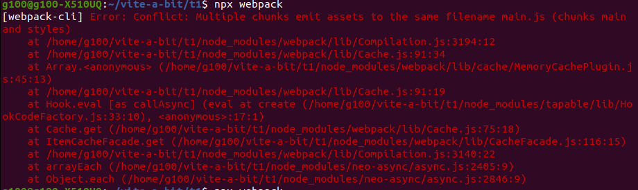
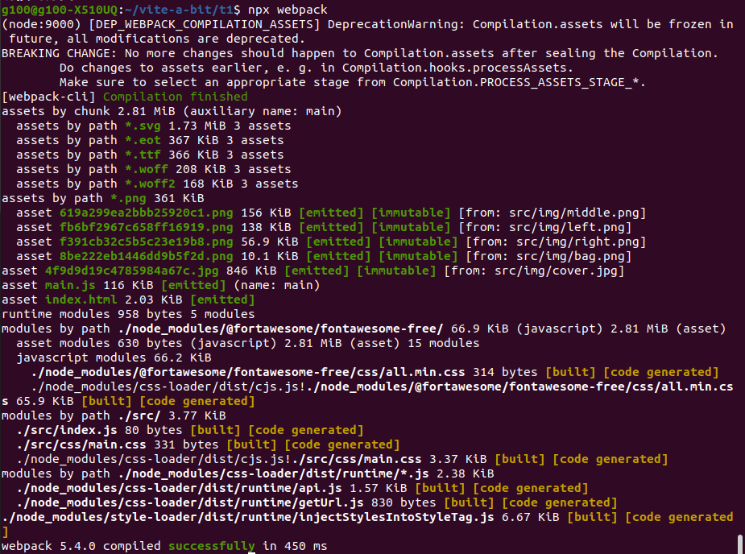
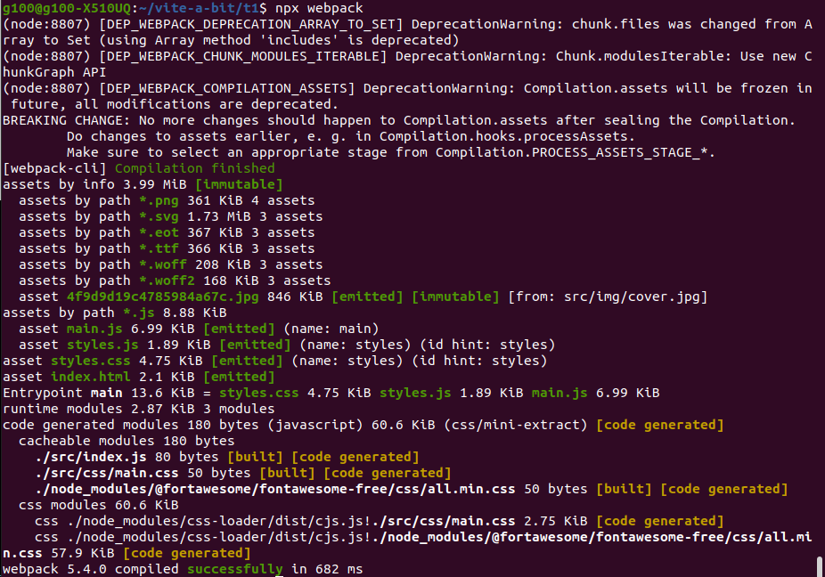

# vite-a-bit
「vite 一下」聚會記錄

---

# t1

## 遇到的錯誤

### question 1
```
/******/  if (!scriptUrl) throw new Error("Automatic publicPath is not supported in this browser");                            ^
  Error: Automatic publicPath is not supported in this browser
```

解決方法： 在 webpack.config.js 裡多加 output.publicPath: ""
publicPath 預設值是 "auto"，


### question 2
```
Multiple chunks emit assets to the same filename main.js
```


解決方法： 改掉寫死的 output.filename ("main.js"), 改為動態的名稱 ("[name].js")

## 嘗試使用 purgecss-webpack-plugin 幫 只用了裡面四個 icon 的 fontawesome 減肥

* 跟 mini-css-extract-plugin 一起搭配服用

* before



* after




## 想問的問題紀錄

 用 html-loader 時， publicPath 為什麼是預設值 'auto' 時會報錯

## 討論後小心得

後來覺得用 js 的作法拆成 component 才比較符合 webpack 的 **模組化**概念？ （但是麻煩＝ ＝）

html-loader 可以想像成 把 template html file 轉換成 js code , 
在配合 asset | file-loader 把檔案用 js 語法 requie 並且插入到 原本的 inline src 位置

---

# t3

## 遇到的疑惑

1. 不必在 index.js 裡面 import jquery 只需要安裝就可以妥當的包好並且運作正常? (npm)
	20201118.Lo.t2.1
> 因為bootstrap 裡面的 js file 就已經有 require jquery 的程式碼, 所以不需要自己引入， 但是仍然需要安裝
2. 直接在 index.js 裡面寫  `import "bootstrap"`, 結果是根據 bootstrap module 裡面的 package.json 的 main 所聲明的檔案 (npm)
3. 瀏覽器出現 `DevTools failed to load SourceMap: Could not load content for webpack://t2/node_modules/bootstrap/dist/js/bootstrap.bundle.js.map: HTTP error: status code 404, net::ERR_UNKNOWN_URL_SCHEME`
	1. 

	1. 根據 [stack over flow] (https://stackoverflow.com/questions/61767538/devtools-failed-to-load-sourcemap-for-webpack-node-modules-js-map-http-e)可以透過 source-map-loader 來解決

---


# t6

1. 使用 sass-loader 需要 rewrite 路徑

[What is the problem with sass](https://github.com/bholloway/resolve-url-loader/blob/v4-development/packages/resolve-url-loader/README.md#whats-the-problem-with-sass)

2. HMR: 原本的程式碼已經因為 HMR 更新，但是瀏覽器上的程式碼可能還在使用舊的 referance

[Gotchas](https://webpack.js.org/guides/hot-module-replacement/#gotchas)
