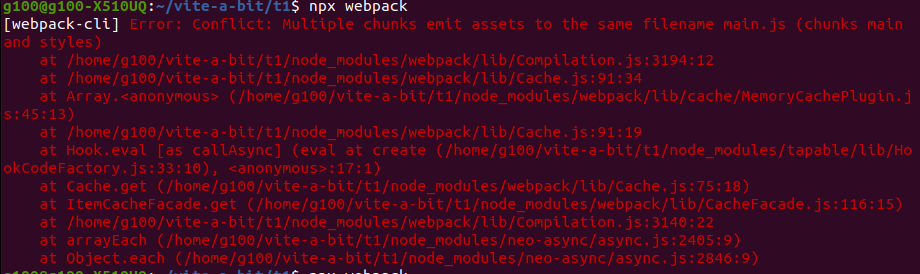
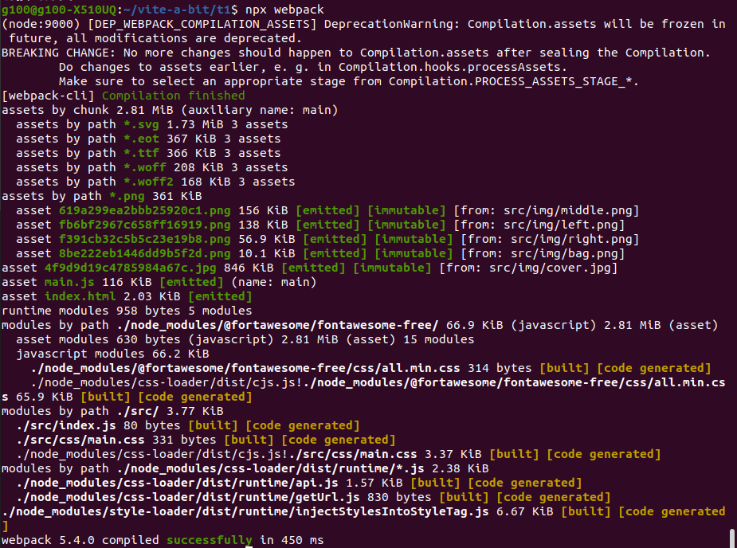
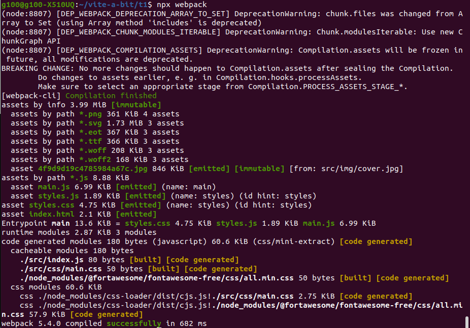

# t1

## 遇到的錯誤

### question 1
```
/******/  if (!scriptUrl) throw new Error("Automatic publicPath is not supported in this browser");                            ^
  Error: Automatic publicPath is not supported in this browser
```

解決方法： 在 webpack.config.js 裡多加 output.publicPath: ""
publicPath 預設值是 "auto"，


### question 2
```
Multiple chunks emit assets to the same filename main.js
```


解決方法： 改掉寫死的 output.filename ("main.js"), 改為動態的名稱 ("[name].js")

## 嘗試使用 purgecss-webpack-plugin 幫 只用了裡面四個 icon 的 fontawesome 減肥

* 跟 mini-css-extract-plugin 一起搭配服用

* before



* after




## 想問的問題紀錄

 用 html-loader 時， publicPath 為什麼是預設值 'auto' 時會報錯

## 討論後小心得

後來覺得用 js 的作法拆成 component 才比較符合 webpack 的 **模組化**概念？ （但是麻煩＝ ＝）

html-loader 可以想像成 把 template html file 轉換成 js code , 
在配合 asset | file-loader 把檔案用 js 語法 requie 並且插入到 原本的 inline src 位置
