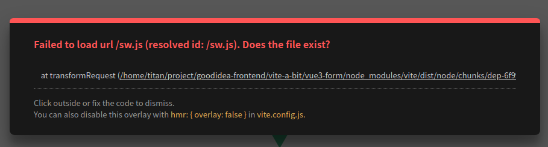
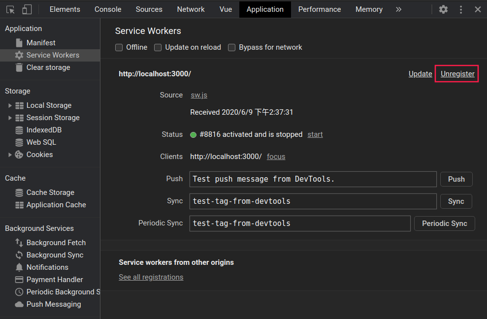

Vite 2
===

# 疑難雜症

## Error: Failed to load url /sw.js. Does the file exist?

遇到以下錯誤：

```
[vite] Internal server error: Failed to load url /sw.js (resolved id: /sw.js). Does the file exist?
      at transformRequest (/home/titan/project/goodidea-frontend/vite-a-bit/vue3-form/node_modules/vite/dist/node/chunks/dep-6f99a5ef.js:60107:15) (x2)
```




發生的原因：在同一個 localhost port 上使用 service worker 載入另一個 app，瀏覽器以為是同一個 app，並嘗試請求 service worker。

解決方法：
- 從 DevTools 的「Application」tab 刪除該 localhost port 的 service worker
- 或使用其他 port




資料來源：[Error: Failed to load url /sw.js. Does the file exist? · Issue #1427 · vitejs/vite](https://github.com/vitejs/vite/issues/1427#issuecomment-757364779)
